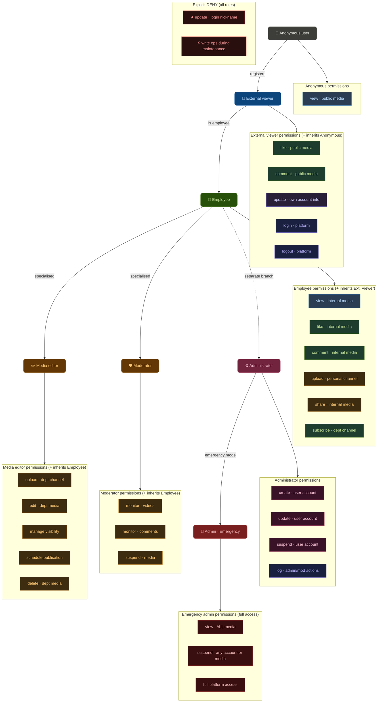

# MHP RBAC Policy Tree

University homework — Role-Based Access Control (RBAC) policy design for a media-hosting platform (MHP).

## Overview

This project models the access-control policy of an internal media platform using a hierarchical RBAC approach. Roles inherit permissions from their parent, with explicit DENY rules that apply across all roles.

## Role Hierarchy

| Role | Inherits from | Description |
|---|---|---|
| Anonymous | — | Unauthenticated visitor |
| External Viewer | Anonymous | Registered external user |
| Employee | External Viewer | Internal staff member |
| Media Editor | Employee | Manages departmental media |
| Moderator | Employee | Monitors and enforces policy |
| Administrator | Employee (separate branch) | User and platform management |
| Emergency Admin | Administrator | Full platform override |

## Diagram

## Files

| File | Description |
|---|---|
| [`MHP_RBAC_Tree.html`](./MHP_RBAC_Tree.html) | Interactive live diagram with Mermaid editor |
| [`rbac-diagram.mmd`](./rbac-diagram.mmd) | Raw Mermaid source file |
| [`rbac-diagram.svg`](./rbac-diagram.svg) | Static SVG export of the diagram |

## Cross-cutting DENY rules

The following operations are **denied for all roles**, regardless of any inherited permissions:

- `✗ update · login nickname` — usernames are immutable once set
- `✗ write ops during maintenance` — platform-wide write lock during maintenance windows

## Permission colour legend

| Colour | Permission category |
|---|---|
| Blue | View |
| Green | Interact (like, comment, subscribe) |
| Orange | Content management (upload, edit, delete) |
| Purple | Account management |
| Pink | Administrative |
| Red | Emergency / DENY |
